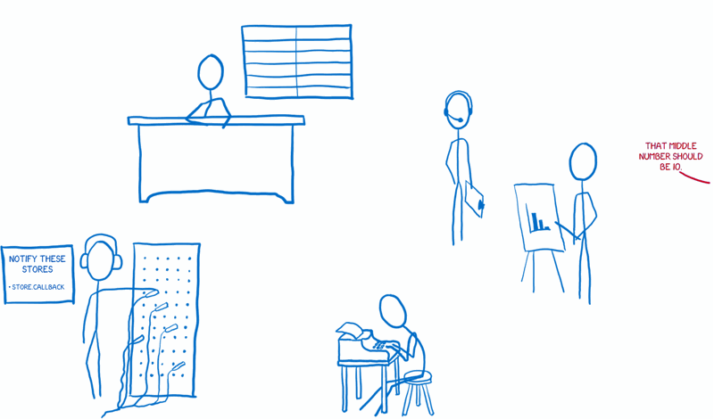
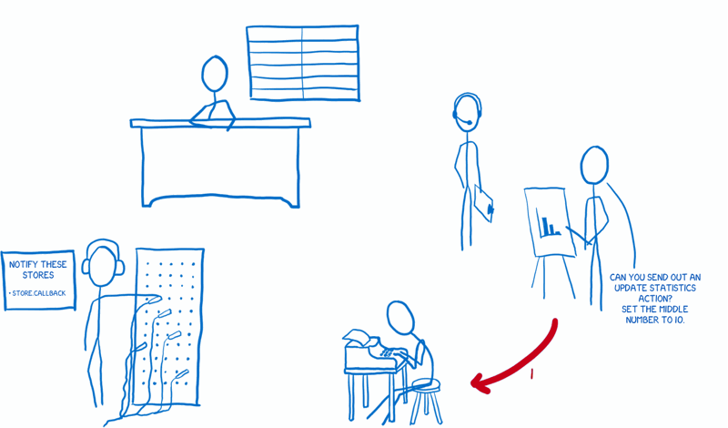
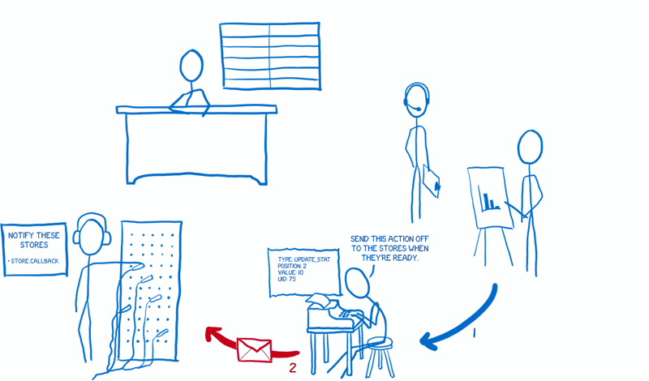
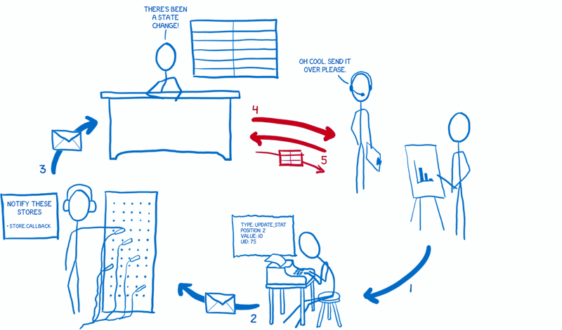
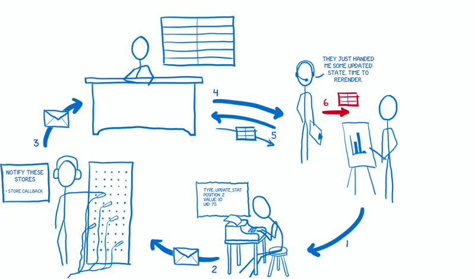

 

원문: https://medium.com/code-cartoons/a-cartoon-guide-to-flux-6157355ab207

Flux는 현재 웹 개발에서 가장 인기 있는 토픽 중 하나이면서도 가장 이해되고 있지 않은 토픽 중 하나이다. 이 안내서는 모두가 이해할 수 있도록 설명하기 위해서 작성되었다.

## 문제점

먼저, Flux가 해결할 수 있는 기본적인 문제에 대해 설명해야만 한다. Flux는 당신의 애플리케이션에서 데이터를 취급하기 위한 패턴(pattern)이다. Flux와 React는 Facebook에서 함께 성장해왔다. 많은 사람들이 이 둘을 함께 사용하지만, 사실 독립적으로도 사용할 수 있다. Flux와 React는 Facebook이 가지고 있었던 특정한 문제점들을 해결하기 위해서 개발되었다.

이 문제점들 중 가장 잘 알려져 있는 것은 알림(notification) 버그이다. Facbook에 로그인 했을 때 [화면 위의] 메시지 아이콘에 알림이 떠 있지만, 그 메시지 아이콘을 클릭해서 들어가보면 아무런 메시지가 없던 적이 있었을 것이다. 알림은 사라지겠지만, 몇 분 뒤 알림이 다시 나타나고 여전히 아무런 메시지도 나타나지 않는다. 그리고 이 사이클(cycle)은 계속 반복된다.

이 사이클은 단순히 사용자 뿐만이 아니라 Facebook의 팀에서도 있었다. 팀이 이 버그를 고치고 얼마동안은 괜찮았지만 [업데이트를 하다보면] 곧 다시 나타났다. 이렇게 해결되고 다시 문제가 생기는 사이클이 계속 반복되었다.

그래서 Facebook은 이 사이클을 벗어날 방법을 찾고 있었다. 단순히 단기적인 해결책이 아니라, 시스템을 더욱 예측가능하게 만들어서 문제점을 완전히 없애길 원했다.

## 근본적인 문제점

Facebook이 찾은 근본적인 문제점은 데이터가 애플리케이션을 흐르는 방법에 있었다.

*Note: 이것은 Facebook이 공유한 단순화된 문서로 부터 모은 것이다. 실제 아키텍처(architecture)는 이것과는 아주 다를 것이다.*

이전에는 데이터를 가지고 있는 모델(model)이 렌더링(rendering)을 하기위해 뷰 레이어(view layer)로 데이터를 보냈을 것이다.

사용자와의 상호작용(user interaction)이 뷰(view)를 통해서 일어났기 때문에 사용자의 입력에 따라 뷰가 가끔씩 모델을 업데이트해야할 필요가 있었다. 그리고, [의존성(dependency) 때문에] 모델이 다른 모델을 업데이트해야할 때도 있었다.

그 외에도, 가끔씩 이런 것들 때문에 산사태처럼 아주 많은 다른 변경을 초래하기도 했다. 이것은 마치 아주 긴장감 넘치는 Pong 게임1과 같다 -- 공이 어디로 날아갈지 알기 아주 어렵다 (화면 밖으로 가버릴지도 모른다).

또한, 이런 변경들은 비동기적으로(asynchronously) 생길 수도 있었고, 하나의 변경이 다수의 변경들을 일으킬 수 있었다. Pong 게임에 공 한자루를 한꺼번에 던져 넣는다고 상상해보면 이해하기 쉽다. 화면 모든 곳에 공이 마구 뒤섞여서 날아다닐 것이다.

이것은 데이터 흐름을 디버그(debug)하기 어렵게 만든다.

## 해결책: 단방향 데이터 흐름(unidirectional data flow)

그래서 Facebook은 다른 종류의 아키텍처를 시도하기로 결정했다. 이 구조에서 데이터는 단방향으로만 흐르고, 새로운 데이터를 넣으면 처음부터 흐름이 다시 시작된다. 이 아키텍처를 Flux라고 불렀다.

이건 사실 진짜 멋지다... 하지만 위의 다이어그램만 보고는 그렇게 말하긴 아마 좀 힘들것이다.

Flux를 이해하고 나서는, 위의 다이어그램은 아주 쉽게 이해된다. 하지만 만약 Flux에 대해서 완전히 모르는 상태에서 본다면 Flux를 이해하는데 그닥 도움이 되진 않을 것이다.. 하지만 사실 그것이 다이어그램의 목적이다. 세부적인 것들을 제대로 알기 전에 시스템의 전반적인 큰 그림을 보여주는 것이다.

내가 Flux를 이해할 때 도움이 된 것은 이런 다이어그램이 아니라, 시스템을 잘게 나누어 함께 일하는 여러 캐릭터로 생각하는 것이었다. 이제 내가 머릿속에 가지고 있는 이 캐릭터들의 배역을 소개해볼까 한다.

## 캐릭터를 만나보자

모든 캐릭터가 어떻게 같이 상호작용하는지 설명하기 전에 캐릭터들을 간략하게 소개하겠다.

### 액션 생성자(the action creator)

첫번째 캐릭터는 액션 생성자(the action creator)이다. 모든 변경사항과 사용자와의 상호작용이 거쳐가야 하는 액션의 생성을 담당하고 있다. 언제든 애플리케이션의 상태를 변경하거나 뷰를 업데이트하고 싶다면 액션을 생성해야만 한다.

액션 생성자가 하는 일은 마치 전보기사(telegraph operator)와 같다. 무슨 메시지를 보낼지 알려주면 액션 생성자는 나머지 시스템이 이해할 수 있는 포맷으로 바꿔준다 -- [전보기사가 알파벳을 기계들이 처리할 수 있는 모스부호로 바꾸는 것처럼].

액션 생성자는 타입(type)과 페이로드(payload)를 포함한 액션을 생성한다. 타입은 시스템에 정의 된 액션들(일반적으로 상수들) 중의 하나이다. 액션의 예로는 MESSAGE_CREATE이나 MESSAGE_READ같은 것이 있다.

모든 가능한 액션들을 아는 시스템을 가짐으로써 부차적으로 갖는 멋진 효과가 있다. 새로운 개발자가 프로젝트에 들어와서 행동 생성자 파일을 열면 시스템에서 제공하는 API 전체 -- 모든 가능한 상태변경 -- 를 바로 확인할 수가 있다는 점이다.

일단 액션 생성자가 액션 메시지를 생성한 뒤에는 디스패쳐(dispatcher)로 넘겨준다.

### 디스패쳐(dispatcher)

디스패쳐는 기본적으로 콜백(callback)이 등록되어있는 곳이다. 이것은 마치 전화 교환대에서 교환원이 일하는 것과 같다 -- [전화 교환대에서는 등록된 모든 전화들과의 연결이 가능하다]. 디스패쳐는 액션을 보낼 필요가 있는 모든 스토어(store)를 가지고 있고, 액션 생성자로부터 액션이 넘어오면 여러 스토어에 액션을 보낸다.

이 처리는 동기적으로(synchronously) 실행되어서 위쪽에서 이야기했던 다수의 공으로 플레이하는 Pong 게임같은 경우를 처리하는데 도움을 준다. 만약 스토어들 사이에 의존성(dependency)이 있어서 하나를 다른 것보다 먼저 업데이트를 해야한다면, waitFor()를 사용해서 디스패쳐가 적절히 처리하도록 할 수 있다.

Flux의 디스패쳐는 다른 아키텍처들과는 조금 다른 점이 있다. 바로 액션 타입과는 관계없이 등록된 모든 스토어로 보내진다는 점이다. 이말인 즉슨, 스토어가 특정 액션만 구독(subscribe)하지 않고 모든 액션을 일단 받은 뒤 처리할지 말지를 결정한다는 뜻이다.

### 스토어(store)

다음은 스토어이다. 스토어는 애플리케이션 내의 모든 상태와 그와 관련된 로직을 가지고 있다.

스토어는 마치 모든 것을 관리하는 정부관료와 같다. 모든 상태 변경은 반드시 스토어에 의해서 결정되어야만 하며, 상태 변경을 위한 요청을 스토어에 직접 보낼 순 없다. 스토어에는 설정자(setter)2가 존재하지 않으므로, 상태 변경을 요청하기 위해서는 반드시 모든 정해진 절차를 따라야만 한다... 다시말해, 무조건 액션 생성자/디스패쳐 파이프라인을 거쳐서 액션을 보내야만 한다.

위에서도 설명했듯이, 만약 스토어가 디스패쳐에 등록되어 있다면, 모든 액션을 받게 될 것이다. 스토어의 내부에서는 보통 switch statement를 사용해서 처리할 액션과 무시할 액션을 결정하게 된다. 만약 처리가 필요한 액션이라면, 주어진 액션에 따라서 무엇을 할 지 결정하고 상태를 변경하게 된다.

일단 스토어에 상태 변경을 완료하고 나면, 변경 이벤트(change event)를 내보낸다. 이 이벤트는 컨트롤러 뷰(the controller view)에 상태가 변경했다는 것을 알려주게 된다.

### 컨트롤러 뷰(the controller view)와 뷰(the view)
뷰는 상태를 상태를 가져오고 유저에게 보여주고 입력받을 화면을 렌더링하는 역할을 맡는다.

뷰는 발표자와 같다. 애플리케이션 내부에 대해서는 아는 것이 없지만, 받은 데이터를 처리해서 사람들이 이해할 수 있는 포맷(HTML)으로 어떻게 바꾸는지 알고 있다.

컨트롤러 뷰는 스토어와 뷰 사이의 중간관리자같은 역할을 한다. 상태가 변경되었을 때 스토어가 그 사실을 컨트롤러 뷰에게 알려주면, 컨트롤러 뷰는 자신의 아래에 있는 모든 뷰에게 새로운 상태를 넘겨준다.

## 어떻게 함께 동작하는가

그러면 이 캐릭터들이 어떻게 함께 동작하는지 살펴보자.

### 준비(the setup)

먼저 애플리케이션이 초기화할 때 딱 한번 준비과정을 가진다.

1. 스토어는 디스패쳐에 액션이 들어오면 알려달라고 말해둔다.

2. 컨트롤러 뷰는 스토어에게 최신 상태를 묻는다.

3. 스토어가 컨트롤러 뷰에게 상태를 주면 렌더링하기 위해 모든 자식 뷰에게 상태를 넘겨준다.

4. 컨트롤러 뷰는 스토어에게 상태가 바뀔 때 알려달라고 다시 부탁한다.

### 데이터 흐름(the data flow)

준비과정이 끝나면 애플리케이션은 유저 입력을 위한 준비가 완료된다. 사용자의 입력으로 인한 액션이 생겼을 경우를 보자.

사용자 입력으로부터 데이터 흐름을 만들것이다.

1. 뷰는 액션 생성자에게 액션을 준비하라고 말한다.

2. 액션 생성자는 액션을 포맷에 맞게 만들어서 디스패쳐에 넘겨준다.

3. 디스패쳐는 들어온 액션의 순서에 따라 알맞은 스토어로 보낸다. 각 스토어는 모든 액션을 받게 되지만 필요한 액션만을 골라서 상태를 필요에 맞게 변경한다.

4. 상태 변경이 완료되면 스토어는 자신을 구독(subscribe)하고 있는 컨트롤러 뷰에게 그 사실을 알린다.

5. 연락을 받은 컨트롤러 뷰들은 스토어에게 변경된 상태를 요청한다.

6. 스토어가 새로운 상태를 넘겨주면, 컨트롤러 뷰는 자신 아래의 모든 뷰에게 새로운 상태에 맞게 렌더링하라고 알린다.

이것이 내가 생각하는 Flux이다. 도움이 되길 바란다!

## Resources
* [Flux documentation](https://facebook.github.io/flux/docs/overview.html)
* [Fluxxor documentation](http://fluxxor.com/what-is-flux.html)
* [The Case for Flux](https://medium.com/@dan_abramov/the-case-for-flux-379b7d1982c6)

---
- [1]: 아타리(Atari)의 고전게임
- [2]: setter/getter의 한글표기를 고민하다가 [이 블로그 포스팅](http://barunmo.blogspot.com/2013/05/getter-setter.html)을 보고 결정함