 

원문: https://code-cartoons.com/a-cartoon-intro-to-redux-3afb775501a6

Flux를 더 혼란스럽게 만드는 것은 Flux 그 자체보다는 Flux와 Flux에서 영감을 받아 만들어진 Redux간의 차이점이다. 이 글에서는 이 둘의 차이점에 관해 설명할 것이다. 

[Flux에 대한 이전 글](/cartoon-guide-to-flux)을 읽지 않았다면 읽을 것을 추천한다.

## 왜 Flux를 바꿔야하나?
Redux는 Flux가 해결하는 문제점에다가 추가적인 문제점을 더 해결할 수 있다.

Flux와 같이 Redux도 애플리케이션의 상태를 더욱 예측 가능하게 만들어준다. 만약에 상태를 변경하고 싶다면 액션을 발생시켜야 한다. 상태를 저장하고 있는 스토어(store)는 접근자(getter)만 있고 설정자(setter)는 없으므로 직접적으로 상태를 바꿀 방법이 존재하지 않는다. 이런 기본적인 점은 Flux와 Redux가 아주 비슷하다.

그럼 왜 다른 패턴이 필요할까? Redux를 만든 Dan Abramov는 Flux를 더 향상시킬 수 있다는 사실을 찾아냈다. 그는 더 나은 개발자 도구(developer tool)를 사용하길 원했고, Flux에서 몇몇 부분을 조금 바꾸면 더 나은 개발자 도구를 쓸 수 있으면서도 Flux와 같은 예측 가능성을 가질 수 있다는 것을 발견했다.

그는 핫 리로딩(hot reloading)과 시간 여행 디버깅(time travel debugging)를 원했지만([이것에 대한 또 다른 글](/redux-hot-reloading-and-time-travel-debugging)이 있다), Flux로 처리하기에는 어려운 몇몇 문제점들이 있었다.

### 문제점 1: 스토어의 코드는 애플리케이션 상태를 삭제하지 않고는 리로딩(reloading)이 불가능하다

Flux에서 스토어(store)는 다음의 두 가지를 포함한다:

1. 상태 변환을 위한 로직
2. 현재 애플리케이션 상태

스토어 객체 하나가 이 두 가지를 가지고 있는 것은 핫 리로딩을 할 때 문제점을 만든다. 새로운 상태 변환 로직(state change logic)을 위해 스토어 객체를 리로딩하면 스토어에 저장되어있는 기존의 상태까지 잃어버리는 데다가 스토어와 시스템의 나머지 부분 사이에 있는 이벤트 구독(event subscription)까지 망가져 버린다.

#### 해결방법
두 기능을 분리하자. 한 객체는 애플리케이션 상태만을 가지게 하고, 이 객체는 리로딩하지 않도록 하자. 또 다른 객체는 모든 상태 변환 로직을 가지도록 하자. 이 객체는 상태를 가지고 있지 않으므로 걱정없이 리로딩 할 수 있을 것이다.

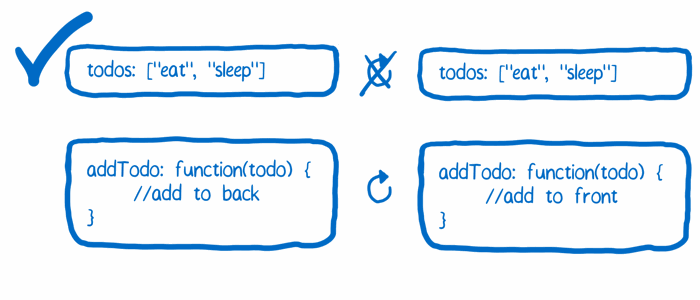

### 문제점 2: 애플리케이션 상태는 매 액션마다 재기록된다

시간 여행 디버깅을 위해서는 상태 객체의 모든 버전들을 기록해두어야 한다. 그걸 가지고 쉽게 이전 상태로 돌아갈 수 있다.

매번 상태가 새로 바뀔 때마다 이전 애플리케이션 상태를 상태 객체의 버전들을 저장하는 배열에 추가할 필요가 있다. 하지만 JavaScript의 동작방식 때문에 단순히 상태를 가진 변수를 배열에다가 추가하는 것만으로는 부족하다. 이 방식으로는 애플리케이션 상태의 스냅샷(snapshot)을 생성하는게 아니라 같은 객체를 가리키는 새로운 포인터(pointer)를 만들 뿐이다.

제대로 동작하게 만들기 위해서는, 각각의 버전이 완벽히 독립된 객체가 될 필요가 있다. 그러면 이전 상태들이 실수로 수정되는 일은 일어나지 않을 것이다.

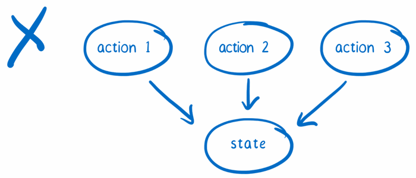

#### 해결방법
액션이 스토어로 전달되었을때 기존의 애플리케이션 상태를 수정하는 대신, 그 상태를 복사한 뒤 복사본을 수정하면 된다.

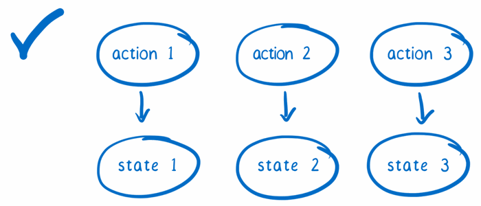

### 문제점 3: 서드파티 플러그인(third-party plugin)이 들어갈 좋은 장소가 없다

개발자 도구는 여러 곳에 쉽게 쓰일 수 있도록 만들어야 한다. 사용자는 자신의 코드를 수정하지 않고도 간단히 코드 몇 줄을 집어넣는 것만으로 개발자 도구를 사용할 수 있어야 한다.

이렇게 하기 위해서는 기존의 코드에 서드파티 플러그인을 추가할 수 있는 장소인 확장점(extension point)이 필요하다.

관련 예제 중 하나로는 로깅(logging)이 있다. 매 액션마다 `console.log()`를 실행한다고 가정해보면, 액션이 들어왔을 때 그 액션의 결과로서 만들어지는 새로운 상태를 로깅할 것이다. Flux에서는 디스패쳐(dispatcher)의 업데이트와 각 스토어의 업데이트를 구독(subscribe)해야만 한다. 하지만 이것은 서드파티 모듈(third-party module)이 쉽게 할 수 있는 것이 아니다.

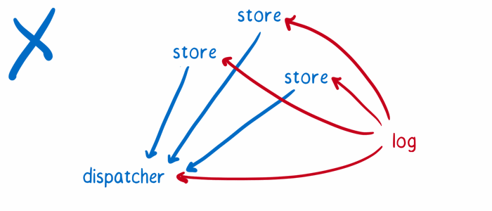

#### 해결방법
시스템의 부분을 다른 객체들로 쉽게 감쌀 수 있게 만들어보자. 이 객체들은 약간의 추가 기능들을 시스템의 부분에 추가한다. 이런 확장점(extension point)을 “enhancer” 또는 “higher order” 객체 혹은 미들웨어(middleware)라고 부른다는 것을 알 수 있다.

또한, 상태 변환 로직(state change logic)을 트리를 사용해서 구조화하자. 상태가 변했다는 것을 뷰에게 알리기 위해 스토어는 단 하나의 이벤트만 보내면 될 것이다. 이 이벤트는 모든 상태 트리가 처리 된 뒤에 보낸다.

*Note: 이런 문제점들과 해결방법으로 개발자 도구 활용 사례를 중점적으로 보았다. 하지만 이런 변화들은 다른 활용 사례에도 도움이 된다. 이 외에도 Redux과 Flux 사이에는 더 많은 차이점이 있다. 예를 들어, Redux는 보일러플레이트(boilerplate)를 줄이고 스토어 내의 로직을 재사용하기 쉽게 만든다. [여기에 Redux의 또 다른 장점 리스트](http://stackoverflow.com/a/32920459)가 있다.*

## 새로운 캐릭터들
Flux에서 Redux로 오면서 캐릭터의 배역이 약간 달라졌다.

### 액션 생성자(action creators)

Redux는 Flux에서 액션 생성자를 그대로 가져왔다. 애플리케이션 상태를 바꾸고 싶다면 항상 액션을 보내야만 한다. 이것이 상태를 바꾸기 위한 유일한 방법이다.

[Flux에 대한 이전 글](/cartoon-guide-to-flux)에서 이야기했듯이 액션 생성자는 전보기사(telegraph operator)와 하는 일이 비슷하다. 어떤 메시지를 보내고 싶은지 액션 생성자에게 알려주면 나머지 시스템이 이해할 수 있는 포맷으로 바꿔준다.

Flux와는 다르게 Redux의 액션 생성자는 디스패쳐(dispatcher)로 액션을 보내지는 않는다. 대신, 포맷을 바꾼 뒤 액션을 돌려준다.

<h3 id="스토어(store)"> 스토어(store) </h3>
Flux의 스토어는 모든 것을 관리하는 정부관료와 같다고 이야기했었다. 모든 상태 변화는 스토어에 의해서 이루어져야 하고 스토어로 직접 요청하는 대신 액션 파이프라인을 따라가야 한다. Redux의 스토어도 역시 같은 역할을 하지만 Flux의 그것과는 약간 다르다.

Flux에서는 다수의 스토어를 가질 수 있다. 각 스토어는 각자의 범위를 갖고 그 내부의 모든 컨트롤을 가진다. 그리고 애플리케이션 상태 중 한 조각을 가지고 있고, 그 상태 조각과 관련된 모든 변환 로직을 가진다.

반면 Redux의 스토어는 좀 더 일을 다른 곳에 위임하는 경향이 있으며, 그렇게 해야만 한다. 왜냐하면, Redux는 단 하나의 스토어만을 가지기 때문이다. 만약 혼자서 모든 것을 처리하려고 한다면 아마 처리할 양이 너무 많을 것이다.

대신, Redux의 스토어는 상태 트리(state tree) 전체를 유지하는 책임을 진다. 액션이 들어왔을 때 어떤 상태변화가 필요한지에 대한 일은 위임하며, 바로 다음에 이야기할 리듀서(reducer)가 그 일을 맡는다.

아마 디스패쳐(dispatcher)가 없다는 것을 눈치챘을지도 모른다. 이것은 스토어가 이 일을 넘겨받았기 때문이다.

### 리듀서(the reducers)
스토어는 액션이 어떤 상태 변화를 만드는지 알 필요가 있을 때 리듀서에게 묻는다. 루트 리듀서(root reducer)는 애플리케이션 상태 객체의 키(key)를 기준 삼아 상태를 조각조각 나눈다. 이렇게 나누어진 상태 조각은 그 조각을 처리할 줄 아는 리듀서로 넘겨준다.

리듀서는 마치 서류 복사에 지나치게 열성적인 사무실 직원들과 같다. 일을 망치는 것에 아주 민감하므로 넘겨받은 예전 상태는 변경하지 않는다. 대신 새로운 복사본을 만든 후 거기에다가 모든 변경사항을 적용한다.

이것이 바로 Redux의 키 아이디어 중 하나이다. 상태 객체는 직접 변경되지 않는다. 대신, 각각의 상태 조각이 복사 후 변경되고 새로운 상태 객체 하나로 합쳐진다.

리듀서는 복사되고 업데이트된 상태 객체를 루트 리듀서에게 넘겨주고, 루트 리듀서는 이 객체를 스토어로 보낸다. 그리고 스토어는 이 객체를 새로운 애플리케이션 상태로 만든다.

만약 작은 애플리케이션이라면 하나의 리듀서만 가지고도 전체 상태의 복사본을 만들고 상태를 변경할 수 있다. 아주 큰 애플리케이션이라면, 많은 리듀서를 가진 큰 리듀서 트리를 사용할 수도 있다. 이것이 Flux와 Redux의 또 다른 점이다. Flux는 스토어가 서로 연결될 필요도 없고 수평적 구조를 가졌다. 반면 Redux는 리듀서가 트리 모양의 계급구조 안에 존재한다. 이 구조는 컴포넌트 구조처럼 필요한 만큼의 레벨(트리의 높이)을 얼마든지 가질 수 있다. 

### 뷰: 영민한 컴포넌트와 우직한 컴포넌트(the views: smart and dumb components)
Flux는 컨트롤러 뷰(controller view)와 일반 뷰(regular view)를 가지고 있다. 컨트롤러 뷰는 중간 관리자 같아서 스토어와 자식 뷰 사이에서 커뮤니케이션을 관리한다.

Redux도 비슷한 컨셉을 가지고 있다. 영민한 컴포넌트와 우직한 컴포넌트가 그것이다. 영민한 컴포넌트는 관리자처럼 행동하는데, Flux의 컨트롤러 뷰보다 몇몇 규칙을 더 따른다.

* 영민한 컴포넌트는 액션 처리를 책임진다. 영민한 컴포넌트 밑의 우직한 컴포넌트가 액션을 보낼 필요가 있을 때, 영민한 컴포넌트는 props를 통해서 우직한 컴포넌트에 함수를 보낸다. 우직한 컴포넌트는 받은 함수를 콜백으로써 단순히 호출만 한다.
* 영민한 컴포넌트는 자기 자신의 CSS style을 가지고 있지 않다.
* 영민한 컴포넌트는 자기 자신의 DOM을 거의 가지고 있지 않다. 대신, DOM 요소들을 관리하는 우직한 컴포넌트들을 관리한다.

우직한 컴포넌트는 액션에 직접 의존성을 가지지는 않는다. 이는 모든 액션을 props를 통해서 넘겨받기 때문이다. 이말인 즉슨, 우직한 컴포넌트는 다른 로직을 가진 다른 애플리케이션에서 재사용될 수 있다는 뜻이다. 또한 어느정도 보기좋게 할만큼의 CSS style도 포함하고 있다 (따로 style props를 받아 기본 style에 병합시켜서 style을 바꿀수도 있다).

### 뷰 레이어 바인딩(the view layer binding)

스토어를 뷰에 연결하기 위해서 Redux는 약간의 도움이 필요하다. 그 둘을 함께 묶어줄 무언가가 필요한데, 이걸 해주는 것이 바로 뷰 레이어 바인딩이다. React를 사용한다면 react-redux가 그것이다.

뷰 레이어 바인딩은 뷰 트리(view tree)를 위한 IT 부서와 같다. 모든 컴포넌트를 스토어에 연결하는 역할을 하며, 많은 기술적인 세부사항들을 처리해서 트리 구조가 세부사항에 신경 쓰지 않도록 해준다.

뷰 레이어 바인딩은 세 개의 컨셉을 가지고 있다:
1. 공급 컴포넌트(provider component): 컴포넌트 트리를 감싸는 컴포넌트이다. `connect()`를 이용해 루트 컴포넌트 밑의 컴포넌트들이 스토어에 연결되기 쉽게 만들어준다.
2. `connect()`: react-redux가 제공하는 함수이다. 컴포넌트가 애플리케이션 상태 업데이트를 받고 싶으면 `connect()`를 이용해서 컴포넌트를 감싸주면 된다. 그러면 `connect()`가 셀렉터(select)를 이용해서 필요한 모든 연결을 만들어준다.
3. 셀렉터(selector): 직접 만들어야 하는 함수이다. 애플리케이션 상태 안의 어느 부분이 컴포넌트에 props로써 필요한 것인지 지정한다.

### 루트 컴포넌트(the root component)

모든 React 애플리케이션은 루트 컴포넌트를 가진다. 이것은 단지 컴포넌트 계층 구조에서 가장 위에 위치하는 컴포넌트일 뿐이다. 하지만 Redux에서는 루트 컴포넌트는 추가로 책임져야 할 것이 존재한다.

루트 컴포넌트가 맡는 임무는 마치 C-level 임원과 같다 -- C-level 임원에는 CEO, CTO, CFO 등이 있다. 루트 컴포넌트는 모든 팀이 일을 하도록 하는 임무를 가진다. 스토어를 생성하고 무슨 리듀서를 사용할지 알려주며 뷰 레이어 바인딩과 뷰를 불러온다.

하지만 루트 컴포넌트는 애플리케이션을 초기화한 뒤로는 거의 하는 일이 없다. 화면을 갱신도 더는 신경 쓰지 않는다. 화면 갱신은 뷰 레이어 바인딩의 도움으로 아래의 컴포넌트들이 맡아서 처리한다.

## 어떻게 함께 동작하는가
애플리케이션을 생성하기 위해 어떻게 이 캐릭터들이 함께 일하는지 살펴보자.

### 준비(the setup)
준비 단계에서는 애플리케이션의 여러 부분이 모두 함께 연결된다.

1. **스토어를 준비한다.** 루트 컴포넌트는 `createStore()`를 이용해서 스토어를 생성하고 무슨 리듀서를 사용할지 알려준다. 루트 컴포넌트는 이미 필요한 모든 리듀서를 가지고 있다. `combineReducers()`를 이용해서 다수의 리듀서를 하나로 묶는다.

2.  **스토어와 컴포넌트 사이의 커뮤니케이션을 준비한다.** 루트 컴포넌트는 공급 컴포넌트로 서브 컴포넌트를 감싸고 스토어와 공급 컴포넌트 사이를 연결한다.    공급 컴포넌트는 기본적으로 컴포넌트를 업데이트하기 위한 네트워크를 생성한다. 영민한 컴포넌트는 `connect()`로 네트워크에 연결한다. 이렇게 상태 업데이트를 받을 수 있게 만든다.

3. **액션 콜백(action callback)을 준비한다.** 우직한 컴포넌트가 액션과 쉽게 일할 수 있게 하기 위해 영민한 컴포넌트는 `bindActionCreators()`로 액션 콜백을 준비한다. 이렇게 간단히 콜백을 우직한 컴포넌트에 넘겨줄 수 있다. 액션은 포맷이 바뀐 뒤 자동적으로 보내진다.

### 데이터 흐름(the data flow)
이제 사용자가 애플리케이션을 사용할 준비가 되었다. 액션을 하나 보내고 데이터 흐름을 확인해보자.

1. 뷰가 액션을 요청한다. 액션 생성자가 포맷을 변환한 뒤 돌려준다.
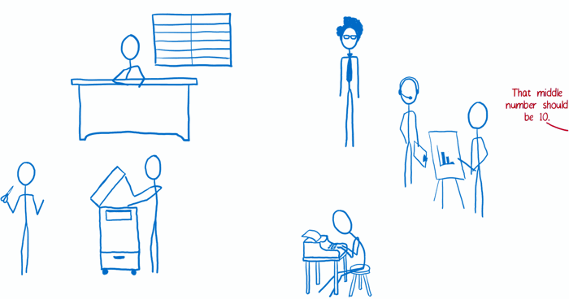

2. `bindActionCreators()`가 준비과정에서 사용되었으면 자동으로 액션이 보내진다. 그게 아니라면 뷰가 직접 액션을 보낸다.

3. 스토어가 액션을 받는다. 현재 애플리케이션 상태 트리와 액션을 루트 리듀서에게 보낸다.
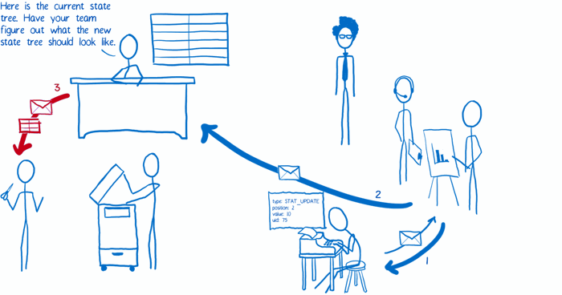

4. 루트 리듀서는 상태 트리를 조각으로 나눈 뒤 알맞은 서브 리듀서로 상태 조각들을 넘겨준다.
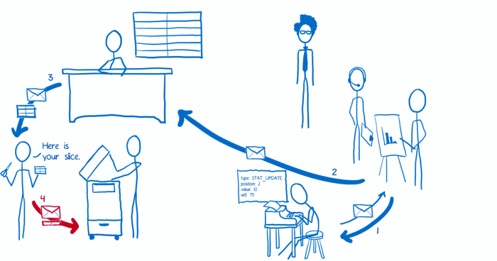

5. 서브 리듀서는 받은 상태 조각을 복사한 뒤, 그 복사본을 변경한다. 루트 리듀서에게 변경된 복사본을 돌려준다.
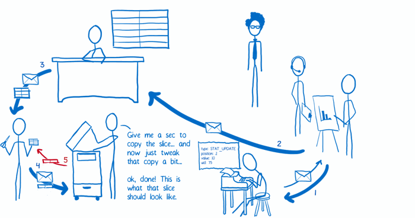

6. 모든 서브 리듀서가 변경 된 상태 조각들을 돌려주면, 루트 리듀서는 이 상태 조각들을 한데 모아 상태 트리로 만든 뒤 스토어로 돌려준다. 스토어는 새로운 상태 트리를 옛날 상태 트리와 바꾼다.
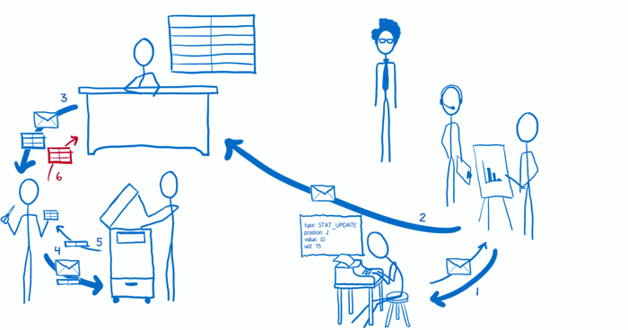

7. 스토어는 뷰 레이어 바인딩에게 애플리케이션 상태가 변경되었다는 것을 알린다.
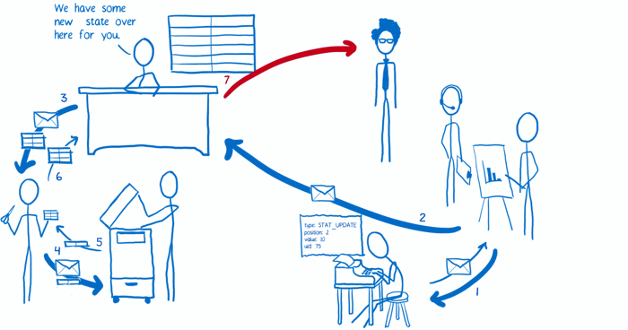

8. 뷰 레이어 바인딩은 스토어에게 새로운 상태를 보내달라고 요청한다.

9. 뷰 레이어 바인딩은 뷰에게 화면을 업데이트하도록 요청한다.
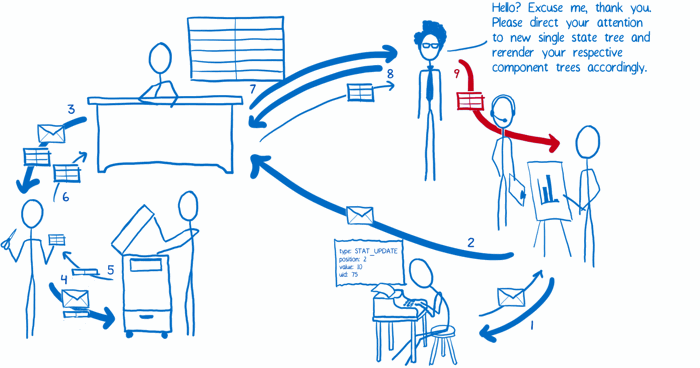

이것이 내가 알고 있는 Redux이고 Flux와의 차이점이다. 도움이 되었길 바란다!

## 관련자료
* [Redux docs](http://rackt.org/redux/index.html)
* [Dan Abramov’s React Europe talk](https://www.youtube.com/watch?v=xsSnOQynTHs)
* [The Evolution of Flux Frameworks](https://medium.com/@dan_abramov/the-evolution-of-flux-frameworks-6c16ad26bb31)
* [Smart and Dumb Components](https://medium.com/@dan_abramov/smart-and-dumb-components-7ca2f9a7c7d0)
* [The upsides of using Redux](http://stackoverflow.com/a/32920459)
* [The downsides of using Redux](http://stackoverflow.com/a/32916602)
* [JS Jabber: The Evolution of Flux Libraries with Andrew Clark and Dan Abramov](https://devchat.tv/js-jabber/181-jsj-the-evolution-of-flux-libraries-with-andrew-clark-and-dan-abramov)