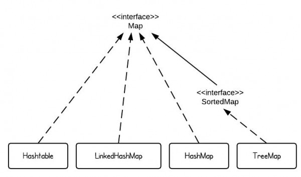

원문: http://www.programcreek.com/2013/03/hashmap-vs-treemap-vs-hashtable-vs-linkedhashmap/

Map은 Java에서 가장 중요한 자료구조중 하나이다. 이 글에서는 HashMap, TreeMap, Hashtable, LinkedHashMap같은 여러 Map 타입에 대해서 다뤄 볼 것이다.

# 1. Map 개요



Java SE에서 가장 흔하게 사용되는 4가지의 Map 구현체가 있다. 바로 HashMap, TreeMap, Hashtable, LinkedHashMap으로, 각각 한 문장으로 설명한다면 다음과 같다.

* HashMap은 hash table을 구현한 것으로 정렬되지 않은 키(key)와 값(value)을 가지고 있다
* TreeMap은 red-black tree 구조를 구현한 것으로 정렬된 키(key)를 가지고 있다
* LinkedHashMap은 값의 입력된 순서를 유지한다
* Hashtable은 HashMap과 달리 동기적(synchronized)이다. 동기화를 위한 오버헤드가 발생한다.
이것이 바로 쓰레드에 안전한 프로그램을 개발할 때 HashMap을 사용해야만 하는 이유이다.

# 2. HashMap

만약 HasMap의 키가 직접 정의한 객체라면, `equals()`와 `hashCode()`의 구현이 필요하다.

```java
class Dog {
	String color;
 
	Dog(String c) {
		color = c;
	}
	public String toString(){	
		return color + " dog";
	}
}
 
public class TestHashMap {
	public static void main(String[] args) {
		HashMap<Dog, Integer> hashMap = new HashMap<Dog, Integer>();
		Dog d1 = new Dog("red");
		Dog d2 = new Dog("black");
		Dog d3 = new Dog("white");
		Dog d4 = new Dog("white");
 
		hashMap.put(d1, 10);
		hashMap.put(d2, 15);
		hashMap.put(d3, 5);
		hashMap.put(d4, 20);
 
		//print size
		System.out.println(hashMap.size());
 
		//loop HashMap
		for (Entry<Dog, Integer> entry : hashMap.entrySet()) {
			System.out.println(entry.getKey().toString() + " - " + entry.getValue());
		}
	}
}

//// OUTPUT ////
// 4
// white dog - 5
// black dog - 15
// red dog - 10
// white dog - 20
```

위의 예제에서는 "white dogs"가 실수로 두 번 입력되었지만 HashMap은 문제없이 [새로운 키로써] 입력을 받아들인다. 이렇게 되면 몇 개의 "white dog"이 HashMap에 존재하는지 알 수 없게 되므로 말이 안된다.

Dog class는 다음과 같이 정의되어야 한다.

```java

class Dog {
	String color;
 
	Dog(String c) {
		color = c;
	}
 
	public boolean equals(Object o) {
		return ((Dog) o).color.equals(this.color);
	}
 
	public int hashCode() {
		return color.length();
	}
 
	public String toString(){	
		return color + " dog";
	}
}

//// OUTPUT ////
// 3
// red dog - 10
// white dog - 20
// black dog - 15
```

그 이유는 HashMap은 동일한 키를 허용하지 않기 때문이다. 기본적으로 [따로 구현되지 않을 경우] Object class의 `hashCode()`와 `equals()`를 사용한다. `Object.hashCode()`는 다른 객체에 대해서는 다른 integer 값을 돌려주고, `Object.equals()`는 같은 객체에 대해서만 `true`를 리턴한다. 더욱 디테일한 내용은 [the hashCode() and equals() contract](http://www.programcreek.com/2011/07/java-equals-and-hashcode-contract/)에서 확인할 수 있다.

# 3.TreeMap

TreeMap은 키로 정렬된다. "키 정렬"의 개념을 이해하기 위해 다음의 예제를 확인하자.

```java
class Dog {
	String color;
 
	Dog(String c) {
		color = c;
	}
	public boolean equals(Object o) {
		return ((Dog) o).color.equals(this.color);
	}
 
	public int hashCode() {
		return color.length();
	}
	public String toString(){	
		return color + " dog";
	}
}
 
public class TestTreeMap {
	public static void main(String[] args) {
		Dog d1 = new Dog("red");
		Dog d2 = new Dog("black");
		Dog d3 = new Dog("white");
		Dog d4 = new Dog("white");
 
		TreeMap<Dog, Integer> treeMap = new TreeMap<Dog, Integer>();
		treeMap.put(d1, 10);
		treeMap.put(d2, 15);
		treeMap.put(d3, 5);
		treeMap.put(d4, 20);
 
		for (Entry<Dog, Integer> entry : treeMap.entrySet()) {
			System.out.println(entry.getKey() + " - " + entry.getValue());
		}
	}
}

//// OUTPUT ////
// Exception in thread "main" java.lang.ClassCastException: collection.Dog cannot be cast to java.lang.Comparable
// 	at java.util.TreeMap.put(Unknown Source)
// 	at collection.TestHashMap.main(TestHashMap.java:35)
```

TreeMap은 키로 정렬되기 때문에, 키 객체는 다른 키 객체과 비교가 가능해야만 한다. 그러므로, 키 객체는 Compariable Interface를 구현해야만 한다. 예를 들면, String은 Comparable Interface를 구현하고 있기 때문에 TreeMap의 키로 사용할 수 있다.

Dog class를 업데이트해서 비교가능하도록 만들어보자.

```java
class Dog implements Comparable<Dog>{
	String color;
	int size;
 
	Dog(String c, int s) {
		color = c;
		size = s;
	}
 
	public String toString(){	
		return color + " dog";
	}
 
	@Override
	public int compareTo(Dog o) {
		return  o.size - this.size;
	}
}
 
public class TestTreeMap {
	public static void main(String[] args) {
		Dog d1 = new Dog("red", 30);
		Dog d2 = new Dog("black", 20);
		Dog d3 = new Dog("white", 10);
		Dog d4 = new Dog("white", 10);
 
		TreeMap<Dog, Integer> treeMap = new TreeMap<Dog, Integer>();
		treeMap.put(d1, 10);
		treeMap.put(d2, 15);
		treeMap.put(d3, 5);
		treeMap.put(d4, 20);
 
		for (Entry<Dog, Integer> entry : treeMap.entrySet()) {
			System.out.println(entry.getKey() + " - " + entry.getValue());
		}
	}
}

//// OUTPUT ////
// red dog - 10
// black dog - 15
// white dog - 20

// 만약 "Dog d4 = new Dog("white", 10);"가 "Dog d4 = new Dog("white", 40);로 바뀌면 결과는 다음과 같을 것이다.
// white dog - 20
// red dog - 10
// black dog - 15
// white dog - 5
```

Dog의 사이즈를 바꿨을 때 결과가 바뀌는 이유는 TreeMap이 `compareTo()`를 사용해서 키를 비교하기 때문이다. [키는 size로 비교되므로] 다른 사이즈의 Dog은 다른 Dog이 된다!

# 4. Hashtable

Java Doc에 따르면:
Hashtable이 비동기적(unsynchronized)이고 `null`을 허용하는 걸 제외하면, HashMap class는 Hashtable과 대략적으로 같다.

# 5. LinkedHashMap

LinkedHashMap은 HashMap의 subclass이다. 그 말인 즉슨, HashMap의 모든 특징을 상속받는다는 말이다. 추가적으로, 링크드리스트(LinkedList)는 입력된 값의 순서를 유지한다.

위의 HashMap에서 사용된 예제에서 HashMap을 LinkedHashMap으로 바꿔보자.

```java
class Dog {
	String color;
 
	Dog(String c) {
		color = c;
	}
 
	public boolean equals(Object o) {
		return ((Dog) o).color.equals(this.color);
	}
 
	public int hashCode() {
		return color.length();
	}
 
	public String toString(){	
		return color + " dog";
	}
}
 
public class TestHashMap {
	public static void main(String[] args) {
 
		Dog d1 = new Dog("red");
		Dog d2 = new Dog("black");
		Dog d3 = new Dog("white");
		Dog d4 = new Dog("white");
 
		LinkedHashMap<Dog, Integer> linkedHashMap = new LinkedHashMap<Dog, Integer>();
		linkedHashMap.put(d1, 10);
		linkedHashMap.put(d2, 15);
		linkedHashMap.put(d3, 5);
		linkedHashMap.put(d4, 20);
 
		for (Entry<Dog, Integer> entry : linkedHashMap.entrySet()) {
			System.out.println(entry.getKey() + " - " + entry.getValue());
		}		
	}
}

//// OUTPUT ////
// red dog - 10
// black dog - 15
// white dog - 20
```

HashMap의 결과와는 다르게 입력된 값의 순서를 유지한다. *[역주: 입력된 "white dog"중 첫번째 값은 두번째 값으로 덮혀씌워진다.]*