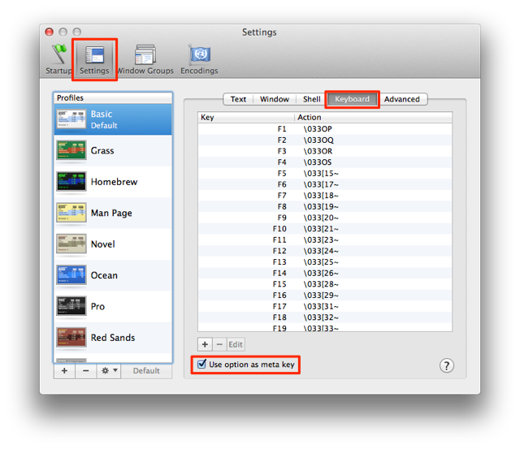

원본: http://ss64.com/osx/syntax-bashkeyboard.html

이미 아시는 분들도 많겠지만 Emacs의 단축키 중 어느정도가 OS X 터미널에서 사용이 가능하다. 나도 조금은 사용을 하고 있었지만 한 번 제대로 써보자 하는 생각이 들어서 정리를 하게 되었다. 정확히 어떤 단축키를 지원하는지 잘 몰라서 구글링을 좀 했는데 꽤 잘 정리된 포스팅이 있어서 번역해 보았다. 직접 OS X Yosemite에서 직접 테스트하면서 작성했고, 더 이해하기 쉽게 세부 카테고리를 나누어서 정리했다. 그리고 원본이 오래되어서 그런지 몰라도 실행이 안되는 경우도 있었는데, 거의 쓰이지 않는 단축키들이라서 그냥 리스트에 포함시키지 않았다.

사용 전에 Alt키의 설정을 조금 손 봐야한다. 아래의 스크린샷처럼 터미널의 키보드 설정에서 Alt키를 Meta키로 사용하는 걸로 바꿔주면 된다. iTerm이나 다른 터미널 어플리케이션에서도 대부분 지원하는 옵션이다.

## 커서 이동:
* Ctrl + a:  라인의 처음
* Ctrl + e:   라인의 끝
*  Alt + b:   커서의 왼쪽 단어 (Option+Right-Arrow)
*  Alt + f:   커서의 오른쪽 단어 (Option+Left-Arrow)
* Ctrl + f:   다음 캐릭터 (Right arrow)
* Ctrl + b:   이전 캐릭터 (Left arrow)
* Ctrl + xx:  라인의 처음과 현재 커서 위치를 토글

## 편집:
### - 삭제
*  Alt + backspace: 커서의 왼쪽 단어를 삭제
*  Alt + d:   커서의 오른쪽 단어를 삭제
* Ctrl + d:   커서가 위치한 곳의 캐릭터를 삭제
* Ctrl + h:   커서의 왼쪽에 있는 캐릭터를 삭제 (backspace)

### - 잘라내기/붙여넣기
* Ctrl + w:   커서의 왼쪽에 있는 단어를 잘라내기
* Ctrl + k:   커서의 오른쪽을 모두 잘라내기
* Ctrl + u:   커서의 왼쪽을 모두 잘라내기
* Ctrl + y:   마지막으로 잘라냈던 걸 붙여넣기 (yank)

### - 수정
* Ctrl + t:   커서아래의 캐릭터와 커서 바로 왼쪽의 캐릭터의 위치를 바꾸기
*  Alt + t:   커서아래의 단어와 바로 이전 단어의 위치를 바꾸기
* Esc  + t:   커서 왼쪽의 두 단어의 위치를 바꾸기
* Alt + u:   현재 커서위치에서 현재 단어의 끝까지의 캐릭터를 대문자로 바꾸기
* Alt + l:   현재 커서위치에서 현재 단어의 끝까지의 캐릭터를 소문자로 바꾸기
* Alt + c:   현재 커서위치의 캐릭터를 대문자로, 나머지 캐릭터는 소문자로 바꾸고 단어의 끝으로 커서를 이동

### - 그 외
* Alt + r:   (다음/이전 커맨드 사용중) 편집을 취소하고 히스토리의 초기 상태로 돌린다
* Ctrl + _:   Undo (편집 한 것을 하나씩 취소)
* Ctrl + l:   화면을 클리어 (clear와 비슷함)
* TAB       파일/디렉터리 이름 자동완성

## 히스토리:
* Ctrl + p:   이전 커맨드 (Up arrow)
* Ctrl + n:   다음 커맨드 (Down arrow)
* Alt + .:   바로 이전 커맨드에서 마지막 단어를 가져오기
* Ctrl + r:   이전 커맨드 히스토리에서 커맨드 검색하기
* Ctrl + g:   검색모드에서 나오기
* Ctrl + o:   커맨드 실행하기
  * 초기 설정에서는 사용할 수 없다. ~/.bash_profile에 `stty discard undef`를 추가한 후 터미널 재시동이 필요하다
  * return/enter 대신 사용할 수 있다

## 프로세스 컨트롤:
* Ctrl + c:   현재 화면에서 실행중인 프로세스를 Kill/Interrupt  (SIGINT)
* Ctrl + d:   (옵션에서 비활성화 되어있지 않다면) EOF 시그널을 보낸다. 현재 쉘이 닫힐 것이다 (EXIT)
* Ctrl + z:   SIGTSTP 시그널로 현재 화면에서 실행중인 프로세스를 suspend 시킨다
  * fg '프로세스 이름' 으로 suspend 된 프로세스를 가져올 수 있다

### Emacs 모드 vs Vi 모드
기본적으로 Bash에서 Emacs의 단축키를 지원하지만 Vi로 바꿀 수 있는 방법이 있다.

#### Vi 모드 변경
`$ set -o vi`
#### Emacs 모드 변경
`$ set -o emacs`

[원본의 라이센스](http://ss64.com/docs/copyright.html)에 따라서 이 글은 다음과 같은 라이센스를 갖는다.

 이 저작물은 <a rel="license" href="http://creativecommons.org/licenses/by-nc-sa/2.0/uk/">크리에이티브 커먼즈 저작자표시-비영리-동일조건변경허락 2.0 영국(잉글랜드, 웨일즈) 라이선스</a>에 따라 이용할 수 있습니다.