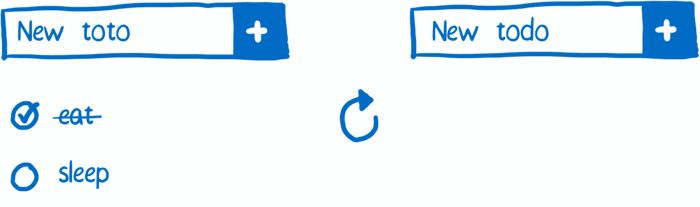
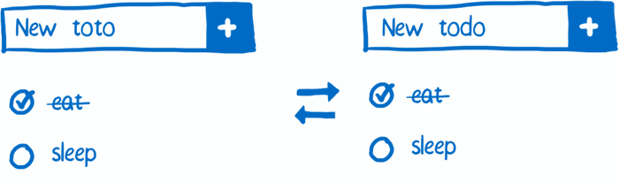
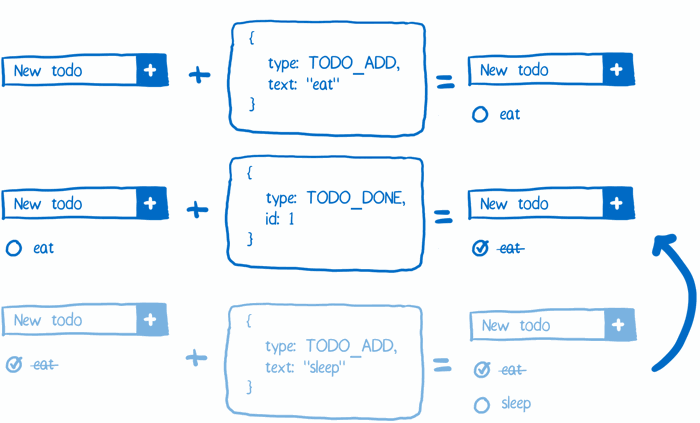

원문: https://code-cartoons.com/hot-reloading-and-time-travel-debugging-what-are-they-3c8ed2812f35

사람들이 열광하는 Redux의 두 가지 기능은 핫 리로딩(hot reloading)과 시간 여행 디버깅(time travel debugging)이다. 이 둘은 과연 무엇일까?

### 핫 리로딩(hot reloading)
애플리케이션을 개발할 때는 일반적으로 코드를 조금씩 수정해가면서 만들게 된다. 매 수정 뒤에 결과를 빨리 확인할 수 있으면 (그리고 작은 실수를 했을 때 고친 뒤 빨리 확인할 수 있다면), 개발 속도를 올릴 수 있을 것이다.

핫 리로딩의 멋진 점은 매 수정 뒤에도 애플리케이션의 상태가 사라지지 않는다는 점이다. todo 애플리케이션의 특정 화면을 테스트한다고 해보자. todo 아이템을 몇 개 추가하고 그 중 몇개는 완료처리를 했는데 그 뒤에 보니 UI 텍스트를 수정을 해야 하는 상황이다. 예를 들어, 플레이스홀더(placeholder)를 “New toto”에서 “New todo”로 수정해야 한다.

핫 리로딩이 없다면, 다음과 같이 해야 할 것이다:

* 코드를 수정한다
* 브라우저의 페이지를 새로고침한다
* 데이터를 재입력한다

핫 리로딩이 사용 가능 하다면 애플리케이션의 상태를 잃어버리지 않기 때문에 데이터를 재입력할 필요가 없다. 모든 todo 리스트가 그대로 유지될 것이고 그만큼 디버깅의 시간이 아주 절약될 것이다.

React 애플리케이션이 데이터를 관리하기 위해 Redux를 사용하지 않는다고 해도 핫 리로딩을 사용할 수는 있다. 핫 리로딩하는 것에 약간의 제약이 생길 뿐이다. 뷰(view)와 액션 생성자(action creator)는 핫 리로딩할 수 있다. 하지만 스토어(store)는 불가능하다. 이것은 스토어가 두 가지 역할을 맡고 있기 때문이다. 애플리케이션 상태를 가지고 있는 것과 그 상태를 액션에 따라 업데이트 하는 것이 바로 그것이다. 상태 업데이트에 관련 된 코드를 리로딩하게 되면 애플리케이션 상태도 같이 리로딩되기 때문에 저장된 상태 정보를 잃어버리게 된다.

Redux가 유용한 점이 바로 상태 변환 로직을 핫 리로딩할 수 있다는 점이다. 그리고 그것은 바로 위의 두 가지 역할을 분리함으로써 가능하다. Redux에서는 스토어가 애플리케이션 상태를 가지고, 상태 변환 로직은 또 다른 객체인 리듀서(reducer)가 관리를 하게 된다. 다시말해서 리듀서를 리로딩하는 것으로 애플리케이션 상태를 잃어버리지 않고 관련 로직만을 핫 리로딩 할 수 있다는 뜻이다.

### 시간 여행 디버깅(time travel debugging)
핫 리로딩은 코드가 바뀌었을 때도 기존의 상태를 유지할 수 있게 만들어준다. 시간 여행 디버깅은 이전의 특정 상태로 돌아갈 수 있게 해준다.

시간 여행 디버깅을 하면 애플리케이션과의 특정 상호작용(interaction)을 빠르게 테스트할 수 있다. 예를 들어, todo 아이템을 하나 완료처리 한 후 또 다른 todo 아이템을 추가했을 때 버그가 있다고 가정하자. 먼저 알려진 시나리오를 따라서 그 버그를 재현한다. 그다음 단순히 바로 이전의 애플리케이션 상태로 돌아간 뒤 다시 새로운 todo 아이템을 추가함으로써 기능을 테스트할 수 있다. [핫 리로딩으로 코드를 업데이트한 후 바로 테스트할 수 있으므로 아주 편리하다.]

그 외에도 멋지게 활용할 수 있는 곳이 또 있다. QA 테스터가 하는 모든 액션을 저장할 수 있다. 만약 QA 테스터가 버그를 발견하면, 액션과 애플리케이션 상태 히스토리(history)를 간단히 저장하면 된다. 또한 자동화 테스트(automated test)에도 적용 가능하다. [저장한 상태 히스토리로 쉽게 버그를 재현하고 고칠 수 있다.]

시간 여행 디버깅은 기술적으로 Flux에도 가능하지만 구현이 복잡한 반면, Redux에서는 아주 간단히 할 수 있다.

## 이어지는 글
Redux가 어떻게 동작하는지 보자: [Redux로의 카툰 안내서](/cartoon-intro-to-redux)